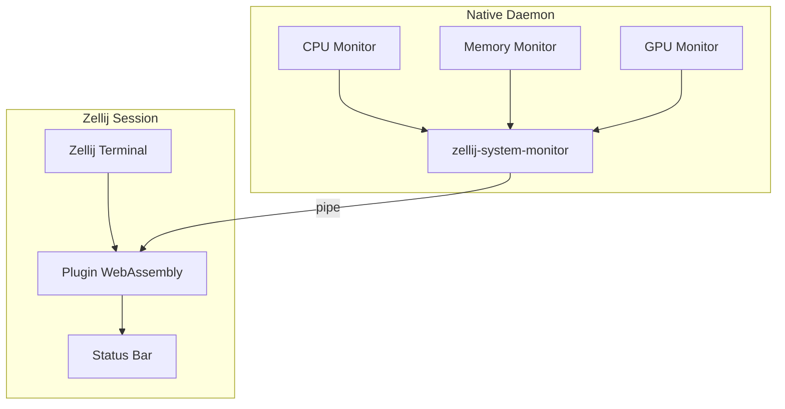
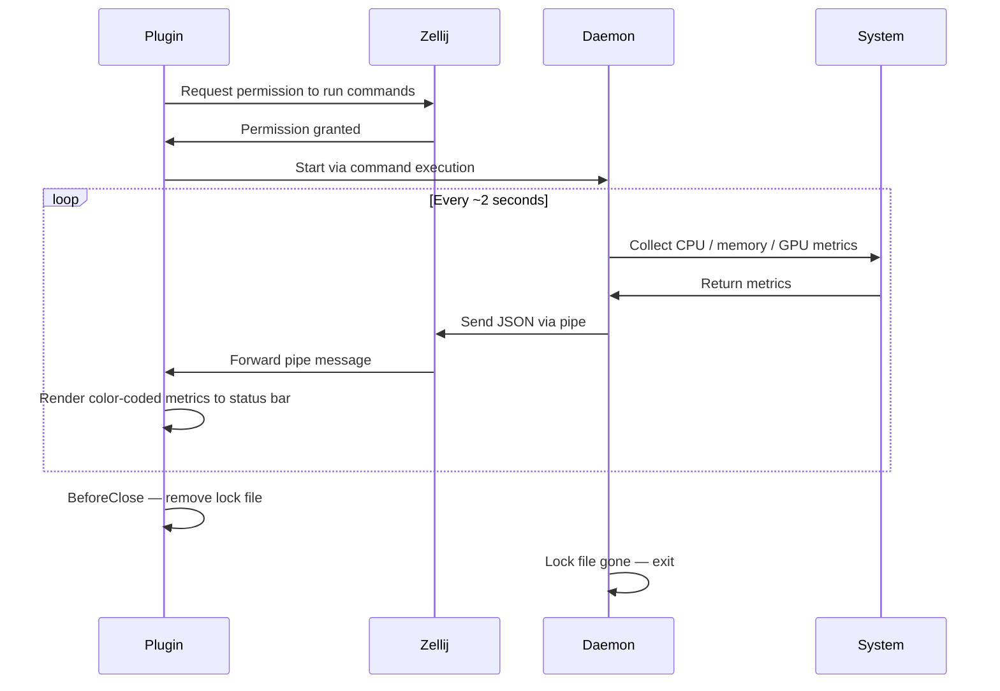

# Zellij Load

A system monitoring plugin for Zellij terminal multiplexer that displays real-time CPU, memory, and GPU usage.


## Overview

Zellij Load is a two-component system monitoring solution for Zellij:
- A native daemon that collects system information
- A WebAssembly plugin that renders the data in the Zellij status bar

The system is designed to be efficient, with minimal resource usage, and provides a clean, color-coded display of system metrics.

## Features

- Real-time CPU usage monitoring
- Memory usage tracking (used/total in GB)
- GPU utilization and VRAM monitoring (optional, auto-detected)
- Color-coded values based on load thresholds:
  - CPU/GPU: green < 50% → yellow < 80% → red ≥ 80%
  - MEM/VRAM: green < 60% → yellow < 80% → red ≥ 80%
- Gracefully fits available terminal width — metrics are dropped right-to-left when space is tight
- Single-instance daemon with automatic lifecycle management

## Building

This project uses [Just](https://github.com/casey/just) for task automation. The `justfile` provides several build targets:

```bash
# Build all components (daemon and WASM plugin)
just build-all

# Build only the native daemon
just build-daemon

# Build only the WASM plugin
just build-wasm

# Install the daemon to system path
just install

# Uninstall the daemon from system path
just uninstall
```

### Prerequisites

- Rust toolchain (latest stable)
- Just (task runner)
- Zellij terminal multiplexer
- For GPU monitoring: GPU drivers with support for querying GPU statistics (currently tested with NVIDIA GPUs)

## Installation and Setup

1. Build the project:
   ```bash
   just build-all
   ```

2. Install the daemon:
   ```bash
   just install
   ```

3. Add the plugin to your Zellij configuration. A ready-to-use example layout is provided in `default.kdl`:
   ```kdl
   layout {
       pane size=1 borderless=true {
           plugin location="tab-bar"
       }
       pane
       pane size=2 split_direction="vertical" {
           pane size="65%" borderless=true {
               plugin location="status-bar"
           }
           pane size="35%" borderless=true {
               plugin location="file:/path/to/zellij-load/target/wasm32-wasip1/release/zellij-load-plugin.wasm"
           }
      }
   }
   ```

   Replace `/path/to/zellij-load` with the actual path to the repository.

**Note: The exact layout is up to you, but the plugin must share a horizontal pane with the status bar (vertical split) so it doesn't occupy its own full line.**

## Development

### Running During Development

```bash
# Run the daemon in debug mode
just run-daemon

# Build and hot-reload the plugin (debug build)
just run-debug

# Build release and hot-reload the plugin
just run
```

### Project Structure

```
zellij-load/
├── src/
│   ├── bin/
│   │   ├── plugin.rs                  # WASM plugin entry point
│   │   └── zellij-system-monitor.rs   # Native daemon entry point
│   ├── system_info/
│   │   ├── cpu.rs                     # CPU usage collection
│   │   ├── gpu.rs                     # GPU usage collection
│   │   ├── mem.rs                     # Memory usage collection
│   │   └── info.rs                    # Shared data structures (SystemMessage, GPU)
│   └── lib.rs                         # Library entry point (render helpers, UsageLevel)
├── .github/workflows/ci.yml           # CI pipeline
├── Cargo.toml                         # Rust project configuration
├── default.kdl                        # Example Zellij layout
└── justfile                           # Build tasks
```

### Architecture

The system consists of two main components that communicate via Zellij's pipe mechanism:

#### Daemon (Native Component)

The native daemon (`zellij-system-monitor`) is responsible for:
- Collecting system metrics (CPU, memory, GPU) every ~2 seconds
- Serializing the data as JSON and piping it into the Zellij session
- Automatically exiting when the plugin's lock file is removed (i.e., when the plugin closes)
- Enforcing single-instance behavior via a system lock

#### Plugin (WebAssembly Component)

The plugin (`zellij-load-plugin.wasm`) is responsible for:
- Requesting `RunCommands` and `OpenFiles` permissions on load
- Spawning the daemon process once permissions are granted
- Receiving JSON metric payloads via Zellij pipes
- Rendering color-coded metrics to the status bar
- Removing the lock file on `BeforeClose` to signal the daemon to stop



### Data Flow

1. The plugin requests permissions and spawns the daemon
2. The daemon polls CPU, memory, and GPU every ~2 seconds
3. Metrics are serialized as JSON and sent via `zellij pipe`
4. The plugin deserializes and renders each update to the status bar
5. When the plugin closes, it removes a lock file — the daemon detects this and exits



## Contributing

Contributions welcome! Please follow these guidelines:

1. Fork the repository
2. Create a feature branch (`git checkout -b feature/amazing-feature`)
3. Make your changes
4. Ensure tests pass and code is properly formatted
5. Commit your changes using [conventional commit messages](https://www.conventionalcommits.org/en/v1.0.0/)
6. Push to the branch (`git push origin feature/amazing-feature`)
7. Open a Pull Request

### Code Style

- Follow Rust conventions and idioms
- Use `rustfmt` to format code
- Use `cargo clippy` to check for common issues
- Document public APIs with Rustdoc comments

### Testing

```bash
# Run native tests
just test

# Run plugin tests (targets wasm32-wasip1)
just test-plugin
```

Before submitting a PR, please ensure:
- All existing tests pass
- New functionality includes appropriate tests
- The daemon starts and can collect system metrics
- The plugin correctly renders the metrics

## Troubleshooting

### Common Issues

1. **Permission Denied**: Ensure the plugin has permissions to run commands and open files
2. **GPU Not Detected**: Verify GPU drivers are properly installed and support querying statistics (currently only tested with NVIDIA GPUs)
3. **Plugin Not Loading**: Check the path in your Zellij configuration is correct
4. **Metrics Frozen**: If the display stops updating, the daemon may have exited — reloading the plugin will respawn it

### Debugging

- Check for a lock file at `/tmp/system-monitor-lock-*` or `$XDG_RUNTIME_DIR/system-monitor-lock-*` to verify the daemon is running
- Monitor system logs for daemon error messages
- Use `zellij setup --dump-config` to inspect plugin configuration

## License

This project is licensed under the MIT License - see the LICENSE file for details.
